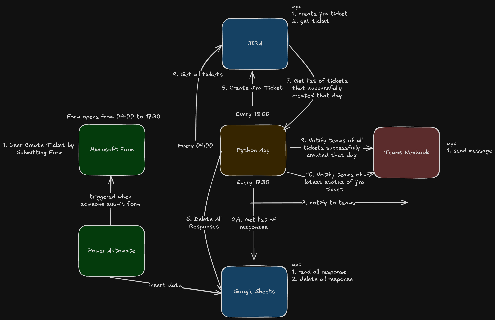

# Jira Ticket Automation Form

## Background

In our team, the team responsible for ticketing was unable or unwilling to create a Jira form that could be easily accessed by users. To address this issue, I took the initiative to create my own custom form that automates the creation of Jira tickets and sends notifications to the relevant Teams channels. This automation streamlines the ticket creation process and ensures that our teams are immediately notified of new issues.

## Project Overview

This project is designed to simplify the process of creating Jira tickets by providing users with an easy-to-fill form. Once a user submits the form, it triggers an automation that:

1. Creates a ticket in Jira.
2. Sends a notification to a specified Microsoft Teams channel with ticket details.
3. Ensures all necessary information is captured, including ticket summary, description, priority, assignee, and other custom fields.

The goal is to make the process seamless for users and improve the workflow for the ticketing team by automating repetitive tasks.

## Features

- **Customizable Form**: Users can fill out the form with necessary ticket details.
- **Jira Ticket Creation**: Automatically creates a ticket in Jira with all the required information.
- **Teams Notifications**: Sends a detailed message to a Microsoft Teams channel to keep relevant stakeholders informed.
- **Easy Integration**: Easily integrates with your Jira instance and Teams channels.

## Project Flow

Below is the workflow diagram for the process from filling out the form to ticket creation and notification on Teams:

## Technologies Used

- **Flask**: A Python web framework used for building the web application and serving the form.
- **Jira REST API V3**: For interacting with the Jira instance and creating tickets.
- **Microsoft Teams Webhook**: For sending notifications to Teams channels.
- **Docker**: Used to containerize the application for easy deployment.
- **Gunicorn**: A WSGI server to run the Flask application in production.
- **Power Automation**: For syncronize data between microsoft form to google sheets.
- **Google Sheets API**: For consume data that users already created.

## Contributing
We welcome contributions to improve the project! If you'd like to contribute, please fork the repository and submit a pull request with your changes.

## Steps for contributing:
1. Fork the repository.
2. Clone your forked repository locally.
3. Create a new branch for your feature or bugfix.
4. Implement your changes.
5. Commit your changes and push to your fork.
6. Open a pull request on the main repository.

## License
This project is licensed under the MIT License - see the LICENSE file for details.

## Contact
For any questions or inquiries, feel free to reach out to me via email at auliaahmadnabil@gmail.com or open an issue in this repository.

